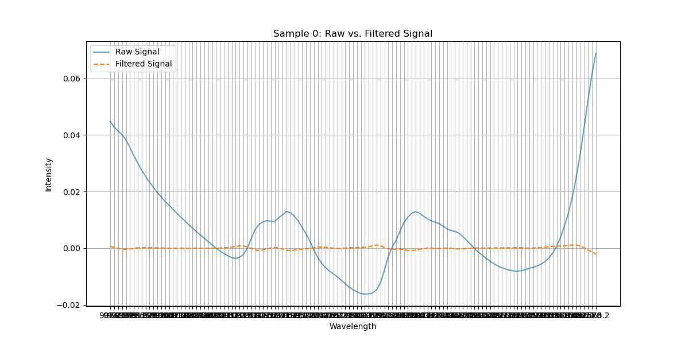

# Miniproject BIO-322: Predicting Heroin Purity
This repository contains the code, analysis, and results for the BIO-322 miniproject. The goal of this project is to predict the purity level of heroin samples using infrared spectra and machine learning techniques.

# Overview 
Confiscated drug samples often require purity analysis for legal and law enforcement purposes. Traditional methods, such as chromatography, are expensive and time-consuming. This project explores cost-effective and real-time solutions using machine learning models to analyze data from portable infrared spectrometry devices. The competition is hosted on Kaggle.

# Authors
Maëlys Clerget & Alice Priolet 

# Code organisation 

- **`data_visualization.py`**: 
- **`preprocessing.py`**: 
- **`bayesian_ridge_regression`**: 
- **`elasticnet_regression`**: 

# 1. Data Visualization

## a. Response variable purity 
- **Purpose**: Understand the distribution of the response variable purity. Assess whether a log transformation can stabilize variance and make the data more normally distributed.
- Visualization: 

- Insights: Applying a log transformation was not conclusive. The inherent distribution of the data, which does not significantly change with the transformation.

## b. Measure type display and prob substance
- **Purpose**: Assess the usefulness of the measure_type_display and prob_substance features.
- Visualization: 
![Measure type display] ALICE
![Prod substance] ALICE
- Insights: The feature measure_type_display had only 4 instances of transparent glass out of 1300 samples. Due to its minimal variance, the column measure_type_display was removed from the dataset. All samples were labeled as heroin. Since the feature provides no additional information, the prod_substance column was removed from the dataset.

## c. Outlier detection 
- **Purpose**: Identify and remove rows where a high proportion of wavelength columns contain outliers.
- Visualization: ALICE
- Insights: ALICE

## d. Correlation matrix 
- **Purpose**: Identify highly correlated features to reduce multicollinearity in a coolwarm colormap. 
- Visualization: In order to obtain the correct graph run preprocessing_v1 with apply_savgol_filter=False

- Insights: Features with a correlation coefficient greater than 0.9999 were removed.

## e. Raw vs Filtered signal 
- **Purpose**: Compare the effect of applying the Savitzky-Golay filter.
- Visualization:

- Insights: The Savitzky-Golay filter smooths the spectral data and computes derivatives. This enhances feature representation for machine learning models.

## f. Feature importance 
- **Purpose**: Identify the most significant features for predicting the target variable (purity) using a Random Forest model.
- Visualization: In order to obtain the correct graph run preprocessing_v1 with apply_savgol_filter=False

- Treshold optimization: To choose the optimal threshold for feature selection, different thresholds were tested, and the cross-validated R² scores were plotted. In order to obtain the correct graph run preprocessing_v1 with apply_savgol_filter=False

- Insights: Features with importance below the chosen threshold (i.e, 0.0048). The cross-validation results helped balance the trade-off between retaining features and improving model accuracy.

quand on fait savgol on fait plus correlation 

# Preprocessing steps 
After testing different combination of preprocessing steps, we decided to keep the following:

## a. Data Cleaning 
- measure_type_display, prob_substance, sample_names columns were dropped 
- No missing values 

## b. Outlier Removal 
- ALICE

## c. Feature Engineering
- One hot encoding to converte categorical features (device_serial, substance_from_display) into numerical features 
- Savitzky-Golay Filtering
- Scaling using StandardScaler()
- Correlation Analysis: removed features with correlation coefficients greater than 0.9999

# Linear Models 
Some visualization were plotted 
## a. Linear regression 
## b. Polynomial regression 
## c. Ridge regression 
- Visualization: 

## d. Bayesian ridge regression
## e. Lasso regression 
## f. Elasticnet regression 
## g. Orthogonal matching pursuit 
- Visualization: 

## h. Huber regression 
## i. Random forest regression 

# Non Linear Models 
## a. Neural Network 

# Summary and Conclusions 
Is a linear method sufficient, or are non-linear methods needed for high accuracy?
• For which machine learning method are transformations of the data needed, and which kind of transformations work best?
• Which predictors are important?
• Is it possible to identify the substances used to mix with heroin?